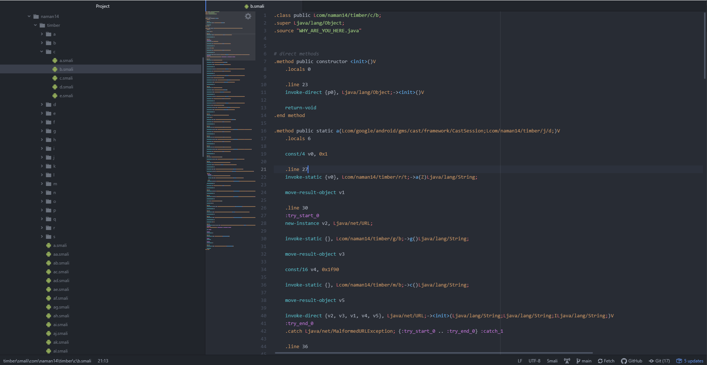

# java-apk-obfuscator
APK black-box obfuscator for my Master's project. Written 100% in Java.

**NOTE**: This obfuscator will NOT work if you are using Java Reflection in
your code. This project only looks at the available code and connects the dots.
Reflection hides connections.

## Obfuscators
### Constant String
> Convert strings to method calls that return the 
> original string through byte manipulation
> 
### Constant Integers
> Add redundant math to const ints to hide from global search: 10 = 14 - 4

### Debug Removal
> Remove debug lines and information

### Field Renaming
> Rename fields

### Method Renaming
> Rename methods

### Method Overloading
> Multiple methods have the same name with different parameters

### Class Renaming
> Rename classes and packages in all the source code and resource files

### Resource Value Renaming
> Rename values in res/values-* folders (colors, strings, ...)

### Resource File Renaming
> Rename drawables and other resource files

# Example Run
## Not Obfuscated

## Obfuscated

# Libraries
* [APKTool](https://github.com/patrickfav/uber-apk-signer) to decompile and build Apks
* [Uber Apk Signer](https://github.com/patrickfav/uber-apk-signer) to sign built Apks

# Want to contribute?
Open an issue!